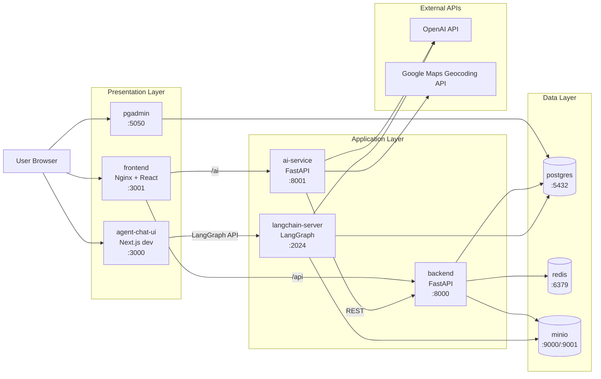

# Freedom Routing - High-Level Container Architecture

## 1. Scope

This document describes the runtime architecture defined by:
- `docker-compose.yml`
- service entrypoints in `backend/`, `ai_service/`, `my-ui-app/`, `agent-chat-ui/`

Goal: provide a clear high-level map of containers and links so you can generate an architecture image in the next step.

## 2. Container Inventory

| Container | Role | Exposed Port(s) | Main Dependencies |
|---|---|---|---|
| `frontend` | Main operations UI (React build served by Nginx) | `3001 -> 80` | `backend`, `ai-service` |
| `agent-chat-ui` | LangGraph chat UI (Next.js dev server) | `3000 -> 3000` | `langchain-server` |
| `backend` | Core REST API + domain CRUD + attachment URL generation | `8000 -> 8000` | `postgres`, `redis`, `minio` |
| `ai-service` | AI analysis + CSV ingestion + routing orchestration | `8001 -> 8001` | `backend`, external APIs |
| `langchain-server` | LangGraph/LangChain NL2SQL + chart generation agent | `2024 -> 2024` | `postgres`, `minio`, OpenAI |
| `postgres` | Primary relational database | `5432 -> 5432` | persistent volume |
| `redis` | Cache backend (repository/cache layer) | `6379 -> 6379` | persistent volume |
| `minio` | S3-compatible object storage (attachments/charts) | `9000`, `9001` | persistent volume |
| `pgadmin` | Postgres administration UI | `5050 -> 80` | `postgres` |

## 3. High-Level Link Map (Container to Container)

### User-facing entrypoints
- Browser -> `frontend` (`http://localhost:3001`)
- Browser -> `agent-chat-ui` (`http://localhost:3000`)
- Browser -> `pgadmin` (`http://localhost:5050`)

### Internal application links
- `frontend` -> `backend` (proxied `/api/*` -> `http://backend:8000/*`)
- `frontend` -> `ai-service` (proxied `/ai/*` -> `http://ai-service:8001/*`)
- `ai-service` -> `backend` (`BACKEND_URL`, default `http://backend:8000`)
- `backend` -> `postgres` (`DATABASE_URL`)
- `backend` -> `redis` (`REDIS_URL`)
- `backend` -> `minio` (`S3_URL`, presigned URLs for attachments/static files)
- `langchain-server` -> `postgres` (direct SQL for NL2SQL)
- `langchain-server` -> `minio` (chart image upload via static file repo)
- `pgadmin` -> `postgres`

### Chat/NL2SQL path
- `agent-chat-ui` -> `langchain-server` (LangGraph API, assistant id `agent`)

### External API links (not in compose)
- `ai-service` -> OpenAI API (LLM tasks)
- `ai-service` -> Google Maps Geocoding API (geo normalization)
- `langchain-server` -> OpenAI API (LLM for NL2SQL agent)

## 4. Mermaid Diagram (Ready for Rendering)

## 5. Main End-to-End Flows

### Flow A: Data Upload (CSV) from main UI
1. User uploads CSV in `frontend`.
2. `frontend` sends to `ai-service` (`/data/upload-*`).
3. `ai-service` parses/validates CSV and writes domain entities via `backend` REST.
4. `backend` persists data in `postgres`.

### Flow B: AI Analysis from DB
1. User triggers analysis in `frontend`.
2. `frontend` calls `ai-service` (`/ai/analyze-from-db`).
3. `ai-service` reads tickets from `backend`, calls OpenAI/geo tasks, writes `ticket_analysis` back through `backend`.
4. Results are stored in `postgres` (and local JSON file inside `ai-service` for observation).

### Flow C: Routing Assignment
1. User triggers routing in `frontend`.
2. `frontend` calls `ai-service` (`/routing/assign-from-db`).
3. `ai-service` fetches managers/analyses/tickets via `backend`, applies heuristic scoring, stores assignments through `backend`.
4. Assignment state ends in `postgres`.

### Flow D: Attachments and Object Storage
1. User uploads image from `frontend`.
2. `frontend` sends file to `backend` `/static/files`.
3. `backend` writes object to `minio`, stores attachment metadata in `postgres`.
4. `backend` can generate presigned URLs for retrieval; UI/AI consumes these URLs.

### Flow E: Chat + NL2SQL
1. User chats in `agent-chat-ui`.
2. `agent-chat-ui` calls `langchain-server` graph (`agent`).
3. `langchain-server` executes read-only SQL against `postgres`, may generate chart SVG and upload it to `minio`, returns result to chat UI.

## 6. Startup and Health Dependency Graph (Compose)

Explicit `depends_on` in compose:
- `backend` waits for healthy `postgres` and `redis`.
- `ai-service` waits for healthy `backend`.
- `frontend` waits for healthy `backend` and started `ai-service`.
- `agent-chat-ui` waits for `langchain-server`.
- `pgadmin` waits for healthy `postgres`.

Important implicit runtime links (not enforced by `depends_on`):
- `backend` expects `minio` reachable.
- `langchain-server` expects `postgres` and `minio` reachable.

## 7. Persistence

Named volumes:
- `pg_data` -> Postgres data
- `redis_data` -> Redis append-only data
- `minio_data` -> object storage data

Bind mounts:
- `./backend:/backend` for live backend/langchain development
- `./agent-chat-ui:/app` for live Next.js development

## 8. Diagram Prompt Helper (Optional)

If you want to generate an image from text, use these node groups:
- **UI**: `frontend`, `agent-chat-ui`, `pgadmin`
- **Application**: `backend`, `ai-service`, `langchain-server`
- **Data**: `postgres`, `redis`, `minio`
- **External**: `OpenAI API`, `Google Maps API`

And these key arrows:
- `frontend -> backend`, `frontend -> ai-service`
- `ai-service -> backend -> postgres`
- `backend -> redis`, `backend -> minio`
- `agent-chat-ui -> langchain-server -> postgres`
- `langchain-server -> minio`
- `ai-service -> OpenAI`, `ai-service -> Google Maps`, `langchain-server -> OpenAI`
